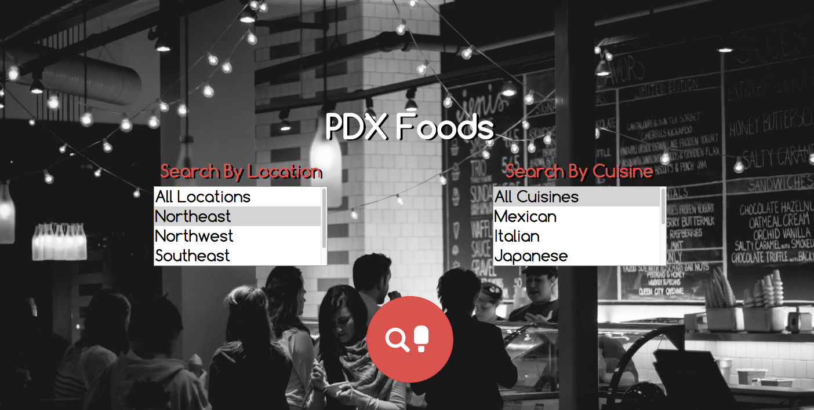

# pdx-foods

#### _A website where users can add restaurants by location and type of cuisine, and add reviews to each restaurant._

#### By _**Adam Craig**_

## Setup/Installation Requirements

In the command line, clone the git repository to a directory (git clone https://github.com/AdamCraig/pdx-foods). Navigate to the local repository's folder and use gradle to run the server (gradle run).

The project comes with two .sql files, pdx_foods and pdx_foods_test. Only pdx_foods is needed for normal functionality with the pre-seeded stylists (and their unique backgrounds). Alternatively, one could set up the database tables in the command line as follows:

In PSQL:

CREATE DATABASE pdx_foods;

CREATE TABLE stylists (id serial PRIMARY KEY, name varchar);

CREATE TABLE clients (id serial PRIMARY KEY, name varchar, stylist_id int);

## Known Bugs

_No known bugs at this time._

## Support and contact details

_For all issues and support, please contact:
Adam Craig at ajcraig@suffolk.edu_

## Technologies Used

_POSTGRESQL, SQL2O, Java, Spark, JUnit, Gradle, Velocity, FluentLenium, HTML, CSS, Bootstrap_

### License

_The MIT License (MIT)

Copyright (c) [2016] [Adam Craig]

Permission is hereby granted, free of charge, to any person obtaining a copy
of this software and associated documentation files (the "Software"), to deal
in the Software without restriction, including without limitation the rights
to use, copy, modify, merge, publish, distribute, sublicense, and/or sell
copies of the Software, and to permit persons to whom the Software is
furnished to do so, subject to the following conditions:

The above copyright notice and this permission notice shall be included in all
copies or substantial portions of the Software.

THE SOFTWARE IS PROVIDED "AS IS", WITHOUT WARRANTY OF ANY KIND, EXPRESS OR
IMPLIED, INCLUDING BUT NOT LIMITED TO THE WARRANTIES OF MERCHANTABILITY,
FITNESS FOR A PARTICULAR PURPOSE AND NONINFRINGEMENT. IN NO EVENT SHALL THE
AUTHORS OR COPYRIGHT HOLDERS BE LIABLE FOR ANY CLAIM, DAMAGES OR OTHER
LIABILITY, WHETHER IN AN ACTION OF CONTRACT, TORT OR OTHERWISE, ARISING FROM,
OUT OF OR IN CONNECTION WITH THE SOFTWARE OR THE USE OR OTHER DEALINGS IN THE
SOFTWARE._
